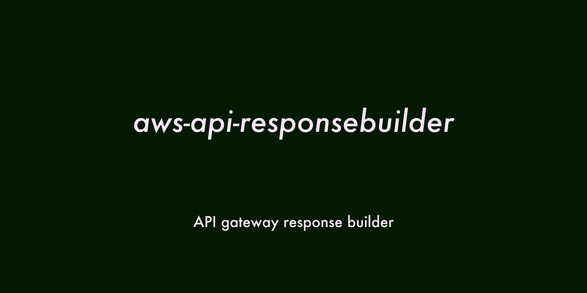

# AWS Amazon API Gateway Response builder
[](https://travis-ci.org/hideokamoto/aws-api-responsebuilder)
[](https://badge.fury.io/js/aws-api-responsebuilder)



AWS API Response Builder is a library that simplifies the process of constructing responses in a type-safe manner when using API Gateway proxy integration with AWS Lambda functions.

## Features

- Flexible configuration of response status code, headers, and body.
- Fluent interface for writing readable code using method chaining.
- Generic type parameters to specify the types of response body and headers.
- Default response of Internal Server Error for easy error handling.
- Default headers for CORS: `Access-Control-Allow-Origin` and `Access-Control-Allow-Credentials`.

## Getting started

Install the library using npm:

```
$ npm i -S aws-api-responsebuilder
```

## Usage

```
import AWSAPIs from 'aws-api-responsebuilder'

const { ResponseBuilder } = AWSAPIs
ResponseBuilder.setStatusCode(400)
ResponseBuilder.setBody({
    message: `Invalid Request`,
    code: 'invalid_request'
})
console.log(ResponseBuilder.getResponse())

{ statusCode: 400,
  headers:
   { 'Access-Control-Allow-Origin': '*',
     'Access-Control-Allow-Credentials': true },
  body: '{"message":"Invalid Request","code":"invalid_request"}' }
```

### TypeScript


```typescript
import { ResponseFactory } from 'aws-api-responsebuilder';

// Build the response
const response = ResponseFactory.init<MyResponseBody, MyResponseHeaders>()
  .setStatusCode(200)
  .updateHeader('Content-Type', 'application/json')
  .setBody({ message: 'Success' })
  .getResponse();

// Use it in the AWS Lambda function handler
export const handler: APIGatewayProxyHandler = async (event, context) => {
  // Return the response
  return response;
};
```

## API Reference

### ResponseFactory.init<Body, Headers>()

Initializes a `ResponseBuilder` object.

- `Body`: Specifies the type of the response body. Default is `any`.
- `Headers`: Specifies the type of the response headers. Default is `APIGatewayResponseHeaders`.

### ResponseBuilder Methods

- `setStatusCode(code: number)`: Sets the status code of the response.
- `updateHeader(key: string, value: string)`: Updates the response headers with the specified key and value. If the header doesn't exist, a new header is created.
- `putHeaders(headers: Headers)`: Sets the response headers in bulk.
- `setBody(body?: Body)`: Sets the body of the response. If the body is not a string, it is converted to JSON. If no body is specified, the `unsetBody()` method is called.
- `unsetBody()`: Removes the body from the response.
- `getResponse()`: Returns the constructed response as `APIGatewayProxyResult` type.

## License

This library is released under the MIT License.
